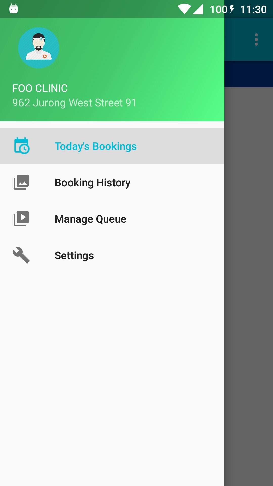
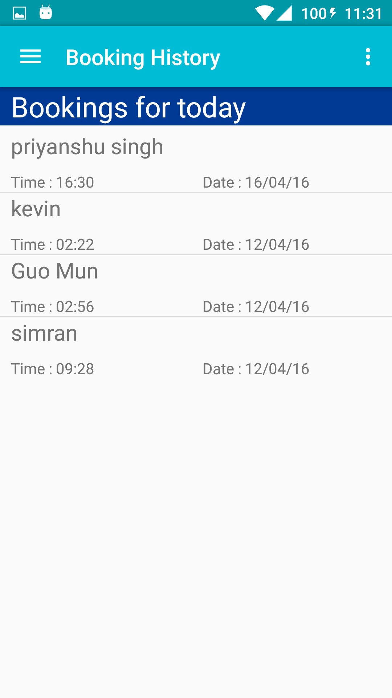
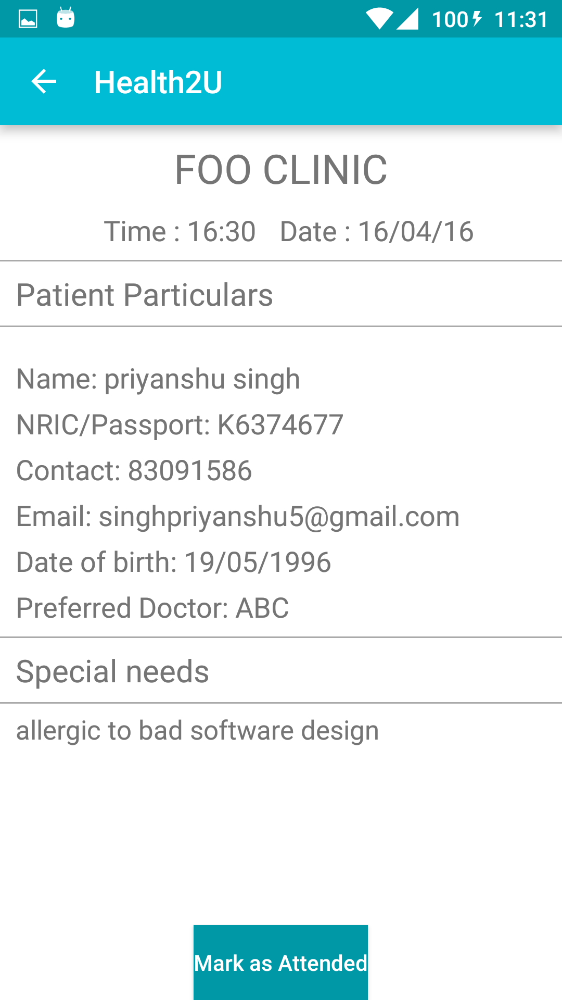
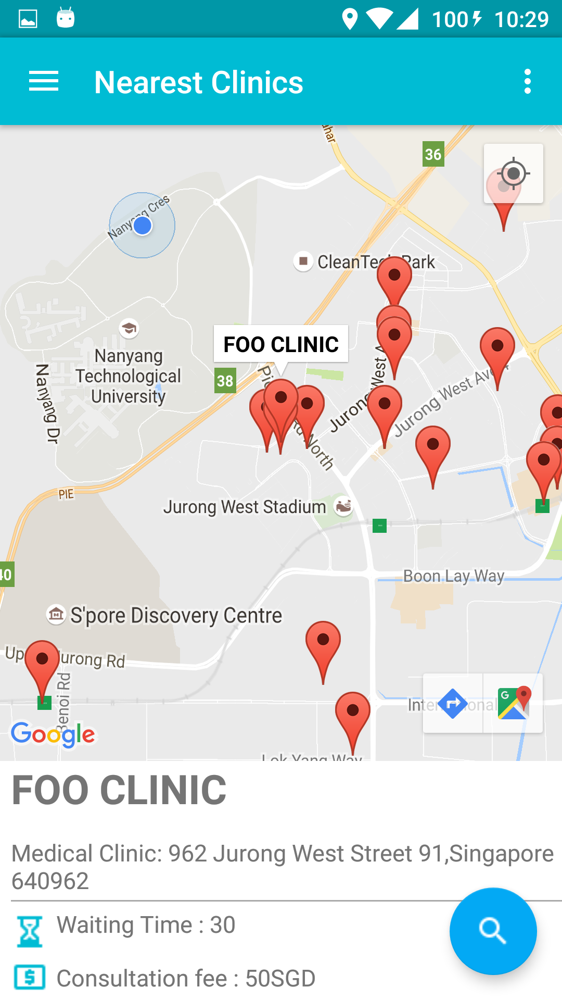

# Health2U
-This application was developed for the Software Engineering project at Nanyang Technlogical University

Health2U is a native android application which allows users to locate the nearest Health Providers(Clinics and Pharmacies) according to their
current location. 
The users are able to see the waiting time and the standard consultation fees for the clinic they choose on the
map.

#Functionalilty and Features

The app has 2 modes: admin mode and user mode

The admin mode is to be used by the health providers to view and manage their queues and appointments.
//inser admin mode screeenshots

On the other hand the user mode is for the patients to view the nearest clinics, make appointments, join queues and view current and past bookings.

Once the users tap on the text fragment at the bottom they are taken to a detailed view for the clinic where they can see other details like contact number,
openeing hours, etc.
From the detailed page they can choose to save the clinic as a favourite, or book an appointment, or enter the queue.

The users are also able to view and manage their current and past bookings. The app also provides push notifications to remind the users about their appointments.

#Technologies and APIs used

Android SDK is used for developing the application.
Parse SDK is used for the backend
CHAS government API is used for getting information about all the registered clinics in Singapore.

